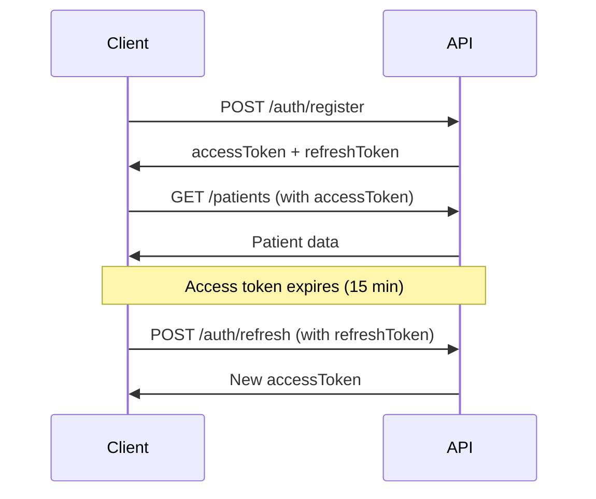

# CareFlow-EHR API Documentation

Complete API documentation for all modules of the CareFlow-EHR system.

---

## 📚 Table of Contents

### Core Modules

1. [**Authentication**](./01-AUTHENTICATION.md)
   - User registration and login
   - JWT token management
   - Password reset
   - Google OAuth integration

2. [**User Management**](./02-USER-MANAGEMENT.md)
   - Admin user operations
   - User CRUD operations
   - Account suspension/activation
   - Role assignment

3. [**Patient Management**](./03-PATIENT-MANAGEMENT.md)
   - Patient profiles
   - Medical history
   - Allergies and conditions
   - Insurance information

4. [**Doctor Management**](./04-DOCTOR-MANAGEMENT.md)
   - Doctor profiles
   - Specializations
   - Working hours
   - Availability management

5. [**Appointment Management**](./05-APPOINTMENT-MANAGEMENT.md)
   - Appointment scheduling
   - Conflict detection
   - Availability checking
   - Status management

### Clinical Modules

6. [**Consultation Management**](./06-CONSULTATION-MANAGEMENT.md)
   - Consultation records
   - Vital signs tracking
   - SOAP notes
   - Diagnosis documentation

7. [**Prescription Management**](./07-PRESCRIPTION-MANAGEMENT.md)
   - Digital prescriptions
   - Medication details
   - Digital signatures
   - Pharmacy integration

8. [**Pharmacy Management**](./08-PHARMACY-MANAGEMENT.md)
   - Partner pharmacies
   - Prescription dispensation
   - Pharmacy notifications

### Laboratory Modules

9. [**Lab Order Management**](./09-LAB-ORDER-MANAGEMENT.md)
   - Lab test ordering
   - Order tracking
   - Priority levels
   - Status management

10. [**Lab Result Management**](./10-LAB-RESULT-MANAGEMENT.md)
    - Test results entry
    - Abnormal flags
    - Critical values
    - PDF report upload

### Document Module

11. [**Document Management**](./11-DOCUMENT-MANAGEMENT.md)
    - File upload (PDF, images, Word, Excel)
    - Presigned URLs
    - Document tagging
    - Verification workflow

### System Module

12. [**Role Management**](./12-ROLE-MANAGEMENT.md)
    - Role CRUD operations
    - Permission management
    - RBAC configuration

---

## 🚀 Quick Start

### Base URL
```
http://localhost:5000/api
```

### Authentication
All protected endpoints require JWT authentication:

```bash
Authorization: Bearer {accessToken}
```

### Common Response Format
```json
{
  "success": true|false,
  "message": "...",
  "data": {...}
}
```

---

## 📊 API Overview

### Total Endpoints: 100+

| Module | Endpoints | Description |
|--------|-----------|-------------|
| Authentication | 8 | User auth & token management |
| User Management | 7 | Admin user operations |
| Patient Management | 6 | Patient profiles & history |
| Doctor Management | 6 | Doctor profiles & availability |
| Appointment Management | 7 | Scheduling & conflict detection |
| Consultation Management | 6 | Medical consultations |
| Prescription Management | 8 | Digital prescriptions |
| Pharmacy Management | 6 | Pharmacy operations |
| Lab Order Management | 7 | Laboratory orders |
| Lab Result Management | 8 | Test results & reports |
| Document Management | 18 | File storage & management |
| Role Management | 5 | RBAC configuration |

---

## 🔐 Authentication Flow



---

## 🎯 Common Use Cases

### 1. Patient Registration & Appointment
```bash
# 1. Register patient
POST /api/auth/register

# 2. Create patient profile
POST /api/patients

# 3. Check doctor availability
GET /api/appointments/availability?doctorId={id}&date=2025-11-10

# 4. Book appointment
POST /api/appointments
```

### 2. Medical Consultation Workflow
```bash
# 1. Get appointment details
GET /api/appointments/{id}

# 2. Create consultation
POST /api/consultations

# 3. Create prescription
POST /api/prescriptions

# 4. Order lab tests
POST /api/lab-orders

# 5. Upload documents
POST /api/documents
```

### 3. Laboratory Workflow
```bash
# 1. Doctor creates lab order
POST /api/lab-orders

# 2. Lab receives sample
POST /api/lab-orders/{id}/receive

# 3. Lab enters results
POST /api/lab-results

# 4. Lab uploads PDF report
POST /api/lab-results/{id}/upload-pdf

# 5. Supervisor validates
POST /api/lab-results/{id}/validate
```

---

## 📝 Request Examples

### Create Patient
```bash
curl -X POST http://localhost:5000/api/patients \
  -H "Authorization: Bearer {token}" \
  -H "Content-Type: application/json" \
  -d '{
    "userId": "...",
    "dateOfBirth": "1990-05-15",
    "gender": "male",
    "bloodType": "A+",
    "allergies": ["Penicillin"]
  }'
```

### Upload Document
```bash
curl -X POST http://localhost:5000/api/documents \
  -H "Authorization: Bearer {token}" \
  -F "file=@report.pdf" \
  -F "patientId=..." \
  -F "documentType=lab_report" \
  -F "title=Blood Test Report"
```

### Generate Presigned URL
```bash
curl -X GET "http://localhost:5000/api/documents/{id}/presigned-url?expiresIn=3600" \
  -H "Authorization: Bearer {token}"
```

---

## 🔒 Security

### Authentication
- JWT with access (15 min) and refresh tokens (7 days)
- Password hashing with bcrypt (10 rounds)
- Account lockout after 5 failed attempts

### Authorization
- Role-based access control (RBAC)
- Permission-based authorization
- Resource ownership validation

### API Security
- Helmet.js security headers
- CORS with whitelist
- Rate limiting
- NoSQL injection prevention
- Input validation (Joi)

---

## 📊 Status Codes

| Code | Meaning | Description |
|------|---------|-------------|
| 200 | OK | Request successful |
| 201 | Created | Resource created |
| 400 | Bad Request | Validation error |
| 401 | Unauthorized | Authentication required |
| 403 | Forbidden | Insufficient permissions |
| 404 | Not Found | Resource not found |
| 409 | Conflict | Resource conflict (e.g., time slot) |
| 429 | Too Many Requests | Rate limit exceeded |
| 500 | Internal Server Error | Server error |

---

## 🎨 Response Examples

### Success Response
```json
{
  "success": true,
  "message": "Operation successful",
  "data": {
    "_id": "...",
    "name": "...",
    "createdAt": "2025-11-02T10:00:00Z"
  }
}
```

### Error Response
```json
{
  "success": false,
  "message": "Validation error",
  "details": [
    {
      "message": "Email is required",
      "path": ["email"]
    }
  ]
}
```

### Paginated Response
```json
{
  "success": true,
  "data": {
    "items": [...],
    "total": 100,
    "page": 1,
    "limit": 20,
    "totalPages": 5
  }
}
```

---

## 🧪 Testing

### Postman Collection
Import the Postman collection for easy API testing:
- [Download Collection](../postman/CareFlow-EHR.postman_collection.json)

### Environment Variables
```json
{
  "baseUrl": "http://localhost:5000/api",
  "accessToken": "{{accessToken}}",
  "refreshToken": "{{refreshToken}}"
}
```

---

## 📞 Support

For API support:
- **Email:** api-support@careflow.com
- **GitHub Issues:** [Report Issue](https://github.com/jaafarhamza/CareFlow-EHR/issues)
- **Documentation:** [Full Docs](https://docs.careflow.com)

---

## 🔄 API Versioning

Current Version: **v1**

All endpoints are prefixed with `/api` (implicit v1).

Future versions will use: `/api/v2`, `/api/v3`, etc.

---

## 📈 Rate Limits

| Endpoint Type | Limit | Window |
|---------------|-------|--------|
| Authentication | 5 req | 15 min |
| Public | 100 req | 15 min |
| Authenticated | 1000 req | 15 min |
| File Upload | 10 req | 15 min |

---

## 🌍 Environments

### Development
```
http://localhost:5000/api
```

### Staging
```
https://staging-api.careflow.com/api
```

### Production
```
https://api.careflow.com/api
```

---

**Last Updated:** November 2, 2025  
**API Version:** 1.0.0  
**Documentation Version:** 1.0.0
